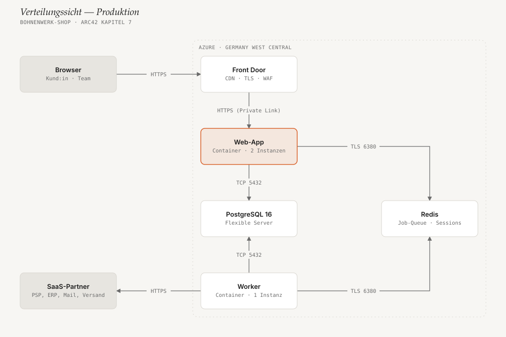

# arc42ify — arc42-Doku als Agent-Skill

Ein Agent-Skill, der aus einem Repo, einer Produktidee oder losen Notizen
eine vollständige [arc42](https://arc42.de/)-Architekturdokumentation macht:
12 Kapitel als Markdown, mit editorial gestalteten SVG-Diagrammen statt
generischer Mermaid-Boxen, als normale Dateien direkt im Repo
(`docs/arc42/`) — kein Build-Schritt, keine externe Abhängigkeit, jedes SVG
öffnet offline im Browser.

Läuft in **Claude Code**, **GitHub Copilot** und **OpenAI Codex**.

## So sieht das Ergebnis aus

Ein vollständig durchgespieltes Beispiel liegt unter
[`docs-example/`](docs-example/docs/arc42/00-index.md): die Architektur eines
fiktiven Online-Shops einer Kaffeerösterei, alle 12 Kapitel, 7 Diagramme.

| Kontextabgrenzung (Kap. 3) | Bausteinsicht (Kap. 5) |
|---|---|
|  |  |
| **Laufzeitsicht (Kap. 6)** | **Verteilungssicht (Kap. 7)** |
|  |  |

## Installation

| Host | Schnellste Installation |
|---|---|
| **Claude Code** | `/plugin marketplace add Chris-Koenig/arc42ify` und `/plugin install arc42ify@arc42ify` |
| **GitHub Copilot** (CLI) | `copilot plugin marketplace add Chris-Koenig/arc42ify` und `copilot plugin install arc42ify@arc42ify` |
| **GitHub Copilot** (VS Code, Cloud-Agent) | `skills/arc42ify` nach `.github/skills/arc42ify` im Repo kopieren |
| **OpenAI Codex** | `codex plugin marketplace add Chris-Koenig/arc42ify` und `codex plugin add arc42ify@arc42ify` |

Ein Repo für ein Team mit gemischten Agenten, Aktualisieren, Entfernen und
Fehlersuche: **[docs/installation.md](docs/installation.md)**.

Voraussetzung: Python 3.8+ (nur Standardbibliothek) und ein Agent mit
Terminal-Zugriff.

## Nutzung

Im Root des Repos, das dokumentiert werden soll:

```text
/arc42ify Erstelle eine arc42-Doku für dieses Repo. Zielgruppe sind
neue Entwickler:innen im Team.
```

| Host | Ausdrücklich aufrufen |
|---|---|
| Claude Code | `/arc42ify` (als Plugin: `/arc42ify:arc42ify`) |
| GitHub Copilot | `/arc42ify` |
| OpenAI Codex | `$arc42ify` |

Ohne ausdrücklichen Aufruf springt der Skill an, sobald die Bitte nach
Architekturdoku klingt. Weitere Aufträge — Idee ohne Code dokumentieren,
Notizen überführen, nach einer Änderung aktualisieren, Diagramme anpassen,
CI-Prüfung: **[docs/usage.md](docs/usage.md)**.

## Ohne Agent

Die Scripts sind eigenständige CLI-Tools:

```bash
# Gerüst im Ziel-Repo anlegen
python3 skills/arc42ify/scripts/scaffold.py /pfad/zum/repo --lang de

# Diagramm: Spec kopieren, anpassen, rendern, prüfen
cp skills/arc42ify/assets/templates/context-diagram.json 03-kontext.diagram.json
python3 skills/arc42ify/scripts/render_diagram.py 03-kontext.diagram.json /pfad/zum/repo/docs/arc42/assets/diagrams/03-kontext.svg
python3 skills/arc42ify/scripts/self_check.py 03-kontext.diagram.json /pfad/zum/repo/docs/arc42/assets/diagrams/03-kontext.svg
```

## Struktur

```
arc42ify/
├── .claude-plugin/
│   ├── marketplace.json           — Marketplace-Katalog (ein Eintrag: arc42ify)
│   └── plugin.json                — Plugin-Manifest (Claude Code, Copilot CLI)
├── .codex-plugin/
│   └── plugin.json                — Plugin-Manifest für Codex (gleicher Skill-Ordner)
├── .agents/plugins/
│   └── marketplace.json           — Marketplace-Katalog für Codex
├── .github/workflows/ci.yml       — führt tests/ bei jedem Push und Pull Request aus
├── skills/arc42ify/               — der Skill; dieser Ordner wird installiert
│   ├── SKILL.md                   — Ablauf, Kapitelzuordnung, wann kein Diagramm
│   ├── references/
│   │   ├── arc42-sections.md      — alle 12 Kapitel: Inhalt, Quelle im Code, Diagrammtyp
│   │   ├── diagram-spec.md        — JSON-Format je Diagrammtyp
│   │   ├── style-guide.md         — Design-Tokens (Farben, Schriften, Prinzipien)
│   │   └── multi-agent-usage.md   — Kurzreferenz Installation je Host (für den Agenten)
│   ├── scripts/
│   │   ├── render_diagram.py      — JSON-Spec → editoriales SVG (keine Abhängigkeiten)
│   │   ├── self_check.py          — Lint für Spec + gerendertes SVG
│   │   └── scaffold.py            — legt docs/arc42/ im Ziel-Repo an
│   └── assets/templates/          — 5 Beispiel-Specs + gerenderte SVGs zum Abschauen
├── docs/
│   ├── installation.md            — Installation je Host, Team-Setup, Fehlersuche
│   ├── usage.md                   — Aufträge, Diagramme ändern und prüfen, CI
│   └── vision.md                  — Zweck, Prinzipien, Roadmap, Non-Goals
├── docs-example/                  — vollständiges Beispiel: Bohnenwerk-Shop (fiktiv)
├── tests/                         — Diagramme, Router, Selbstcheck (mit kaputten Fixtures), Manifeste
└── CONTRIBUTING.md                — neuen Diagrammtyp/Kapitel ergänzen, PR-Checkliste
```

## Warum kein Mermaid, keine Graphviz-Abhängigkeit

- Mermaid-Diagramme sehen in jedem Tool identisch generisch aus — kein
  Corporate Design, kein Fokus-Element, Auto-Layout produziert oft
  unnötig verschachtelte Pfeile.
- Ein `dot`/Graphviz-Binary ist in vielen Agent-Sandboxes und CI-Runnern
  nicht vorinstalliert und lässt sich dort nicht zuverlässig nachinstallieren
  (kein Netz, keine Root-Rechte). `render_diagram.py` braucht nur Python 3
  (stdlib) und läuft überall identisch.
- Das feste 4px-Raster plus expliziter `col`/`row`-Platzierung statt
  Auto-Layout ist bewusst: vorhersagbar, reproduzierbar, und genau der
  Kniff, der Diagramme vom „offensichtlich KI-generiert"-Look wegbringt.

Visueller Stil und Renderer-Architektur sind vom Prinzip von
[diagram-design](https://github.com/cathrynlavery/diagram-design) inspiriert
(ein Akzent, keine Schatten, 1px-Hairlines, 4px-Raster) — hier neu gebaut als
reines Python-Skript ohne Abhängigkeiten.

## Grenzen dieser Version

- Drei Diagrammarten (`boxes` für Kontext/Bausteine/Verteilung, `layers` für
  Schichten, `sequence` für Abläufe) — deckt die arc42-Kapitel ab, die
  tatsächlich ein Bild brauchen (3, 5, 6, 7, 8). Kein ER-Diagramm, kein
  Zustandsautomat; bei Bedarf als weiterer `kind` in `render_diagram.py`
  ergänzbar, siehe [CONTRIBUTING.md](CONTRIBUTING.md).
- Kein automatischer PNG/PDF-Export (Diagramme sind SVG; für Präsentationen
  reicht `Browser → Drucken → PDF` oder ein Screenshot-Tool).
- Marken-Onboarding (automatisches Auslesen einer Website-Farbe) ist nicht
  eingebaut — die Marke wird über `references/style-guide.md` oder ein
  `"theme"`-Feld in der Spec gesetzt.

## Lizenz

[MIT](LICENSE)
