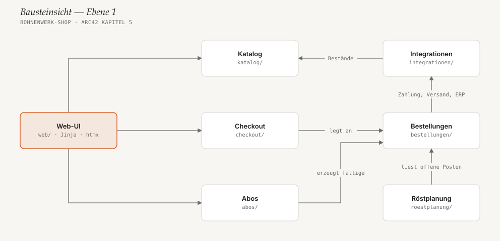
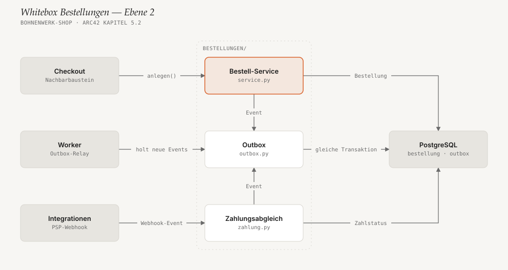

# 5. Bausteinsicht

<!-- status: vollständig -->

## 5.1 Whitebox Gesamtsystem (Ebene 1)

Der Shop ist ein modularer Monolith ([ADR-001](09-architekturentscheidungen.md#adr-001-modularer-monolith-statt-microservices)).
Jeder Baustein ist ein Python-Paket unter `src/bohnenwerk/` mit einer
öffentlichen Schnittstelle in `api.py`; andere Bausteine dürfen nur diese
importieren. Ein Import-Linter in der CI (`import-linter`) prüft das.

Pfeile bedeuten „nutzt“. Die Backoffice-Seiten der Web-UI lesen zusätzlich
Bestellungen und Röstplanung — diese Kanten fehlen im Bild, damit es lesbar
bleibt.

| Baustein | Verantwortung | Schnittstelle (Auszug) |
|---|---|---|
| **Web-UI** | Alle Seiten für Kund:innen und Backoffice, Session, Formulare. Enthält keine Fachlogik. | HTTP-Routen, Jinja-Templates |
| **Katalog** | Sorten, Preise, Röststufen, verkaufbarer Bestand inkl. Sicherheitsbestand. | `sorten()`, `verfuegbar(sorte)` |
| **Checkout** | Warenkorb, Adressen, Versandart; übergibt einen geprüften Warenkorb an Bestellungen. | `warenkorb(session)`, `abschliessen()` |
| **Abos** | Abo-Verträge, Intervalle, Pausen; erzeugt täglich um 06:00 fällige Bestellungen. | `abschliessen()`, `pausieren()`, `faellige_erzeugen()` |
| **Bestellungen** | Lebenszyklus einer Bestellung von „angelegt“ bis „versandt“, Zahlstatus, Outbox. Herzstück des Systems. | `anlegen()`, `offene_posten(bis)`, `als_gepackt_markieren()` |
| **Röstplanung** | Bildet zum Cutoff Chargen je Sorte und ordnet Bestellposten zu. | `cutoff(tag)`, `roestplan(tag)` |
| **Integrationen** | Adapter zu PSP, Mail-Dienst, ERP und Versanddienstleister; Webhook-Endpunkt des PSP; nächtlicher ERP-Abgleich. | `psp.session_anlegen()`, `erp.abgleich()` |

## 5.2 Whitebox Bestellungen (Ebene 2)

Bestellungen bekommt eine eigene Ebene, weil hier das wichtigste
Qualitätsziel entschieden wird: Zahlungen und ihre Folgen dürfen weder
verloren gehen noch doppelt passieren.

| Baustein | Verantwortung |
|---|---|
| **Bestell-Service** (`service.py`) | Legt Bestellungen an, führt Statusübergänge durch (Zustandsautomat in `status.py`), storniert. |
| **Zahlungsabgleich** (`zahlung.py`) | Verarbeitet PSP-Events. Jede Event-ID wird genau einmal verarbeitet (Unique-Constraint auf `psp_event.id`). |
| **Outbox** (`outbox.py`) | Schreibt Folge-Events (`BestellungBezahlt`, `BestellungVersandt` …) in die Tabelle `outbox` — immer in der Transaktion des Aufrufers. |

Der Worker ist kein Teil von Bestellungen: Er holt neue Outbox-Einträge ab und
stellt sie als Jobs in die Redis-Queue. Details in
[8.1](08-querschnittliche-konzepte.md#81-transaktionale-outbox).
