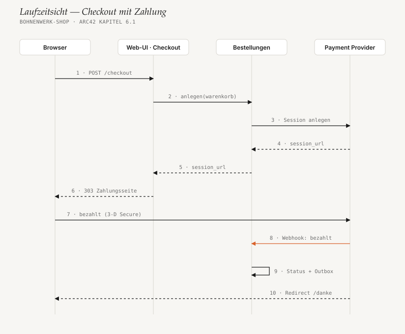
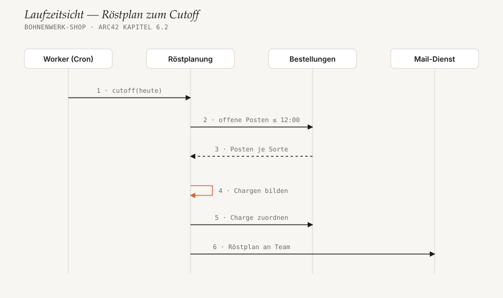

# 6. Laufzeitsicht

<!-- status: vollständig -->

Drei Abläufe, die für die Qualitätsziele entscheidend sind. Die ersten beiden
haben ein Diagramm; der dritte ist linear genug für eine Liste.

## 6.1 Checkout mit Zahlung

1. Die Kund:in schickt den Warenkorb ab.
2. Checkout prüft Adresse und Verfügbarkeit und legt die Bestellung im Status
   `wartet_auf_zahlung` an.
3. Bestellungen erzeugt beim PSP eine Zahlungs-Session. Als Idempotency-Key
   dient die Bestell-ID — ein Doppelklick erzeugt keine zweite Session.
4. – 6. Die Session-URL wandert zurück; der Browser wird auf die Zahlungsseite
   des PSP umgeleitet.
7. Die Kund:in bezahlt dort, ggf. mit 3-D Secure. Der Shop sieht keine
   Kartendaten.
8. **Der PSP meldet die Zahlung per signiertem Webhook.** Nur dieser Weg setzt
   den Zahlstatus ([ADR-003](09-architekturentscheidungen.md#adr-003-zahlstatus-nur-aus-webhooks)).
9. In einer Transaktion: Status auf `bezahlt`, Outbox-Event
   `BestellungBezahlt`. Mail und ERP-Auftrag folgen asynchron über den Worker.
10. Der PSP leitet den Browser auf `/danke`. Die Seite zeigt „Zahlung wird
    bestätigt …“, bis der Webhook eingegangen ist, und lädt per htmx nach.

**Fehlerfälle:** Kommt der Webhook nie an, fragt ein Job nach 30 Minuten den
Status beim PSP ab. Bricht die Kund:in auf der Zahlungsseite ab, verfällt die
Bestellung nach 24 Stunden und gibt den reservierten Bestand frei.

## 6.2 Röstplan zum Cutoff

1. Werktags um 12:00 startet der Worker `cutoff(heute)`.
2. – 3. Röstplanung holt alle Posten, die bis 12:00 bezahlt wurden und noch
   keiner Charge zugeordnet sind, gruppiert nach Sorte und Röstgrad.
4. **Chargen bilden:** je Sorte so viele Chargen, wie nötig — höchstens 15 kg
   Rohkaffee pro Charge (Kapazität der Trommel), Röstverlust 16 % eingerechnet.
5. Jeder Posten bekommt seine Charge. Das macht den Lauf idempotent: Ein
   zweiter Aufruf findet keine offenen Posten mehr.
6. Der Röstplan geht als Mail an das Team und steht im Backoffice.

Fällt der Worker um 12:00 aus, holt er den Cutoff beim Neustart nach — der
Job prüft, ob für den Tag schon ein Röstplan existiert.

## 6.3 Nächtlicher ERP-Abgleich

Bewusst ohne Diagramm — der Ablauf ist eine gerade Linie ohne Verzweigung:

1. Um 02:00 ruft der Worker den Bestandsexport des ERP ab (Roh- und Röstkaffee
   je Sorte).
2. Integrationen schreibt die Bestände in den Katalog. Der Katalog zieht davon
   den Sicherheitsbestand ab (Standard: 5 kg je Sorte).
3. Alle seit dem letzten Lauf bezahlten Bestellungen gehen als Aufträge an das
   ERP, in Blöcken zu 100 Stück.
4. Bestätigte Aufträge werden markiert. Nicht bestätigte bleiben offen und
   gehen in der nächsten Nacht erneut mit.
