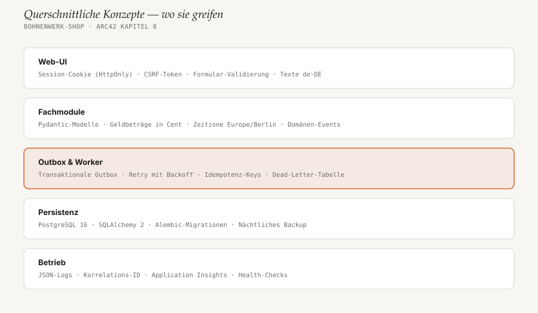

# 8. Querschnittliche Konzepte

<!-- status: vollständig -->

Das Bild zeigt, in welcher Schicht welches Konzept greift. Hervorgehoben ist
die Schicht, die das wichtigste Qualitätsziel trägt.



## 8.1 Transaktionale Outbox

Jede Wirkung nach außen — Mail, ERP-Auftrag, Versandlabel — entsteht aus
einem Outbox-Eintrag, nie direkt im Request. Der Eintrag wird in derselben
Transaktion geschrieben wie die Zustandsänderung, die ihn auslöst. Damit gibt
es keinen Zustand „bezahlt, aber keine Mail geplant“.

```python
# bestellungen/zahlung.py
def zahlung_eingegangen(session: Session, event: PspEvent) -> None:
    bestellung = repo.hole_fuer_update(session, event.bestell_id)
    bestellung.setze_status(Status.BEZAHLT)
    outbox.schreibe(session, BestellungBezahlt(bestell_id=bestellung.id))
    # commit durch den Aufrufer: Status und Event gemeinsam oder gar nicht
```

Der Worker holt alle 5 Sekunden neue Einträge (`SELECT … FOR UPDATE SKIP
LOCKED`) und stellt sie als Jobs in die Redis-Queue. Ein Job wird bis zu 8-mal
mit exponentiellem Backoff wiederholt (1 min bis ca. 4 h). Danach landet er in
der Tabelle `dead_letter`, und das Team bekommt eine Mail — spätestens am
nächsten Morgen wird er von Hand neu angestoßen (OR4).

## 8.2 Idempotenz

Jeder Schritt, der wiederholt werden kann, darf beim zweiten Mal nichts mehr
bewirken:

| Wo | Mechanismus |
|---|---|
| Session beim PSP anlegen | Idempotency-Key = Bestell-ID |
| PSP-Webhook | Unique-Constraint auf `psp_event.id`; Duplikate werden mit `200` quittiert und ignoriert |
| Outbox-Jobs | Jeder Handler prüft zuerst, ob seine Wirkung schon eingetreten ist (z. B. `bestellung.erp_auftrag_id is not None`) |
| Cutoff | Nur Posten ohne Charge werden eingeplant |

## 8.3 Geld und Zeit

- Beträge sind immer `int` in Cent, nie `float`. Preise enthalten Umsatzsteuer
  (Brutto); der Steuersatz steht an der Sorte.
- Zeitpunkte werden als `timestamptz` in UTC gespeichert. Fachliche Regeln
  („bis 12:00“, „Werktag“) rechnen in `Europe/Berlin`; Feiertage für Sachsen
  kommen aus dem Paket `holidays`.

## 8.4 Sicherheit

- Anmeldung für Kund:innen per Magic-Link-Mail, fürs Backoffice zusätzlich mit
  TOTP. Die Session liegt in Redis, im Browser nur ein `HttpOnly`,
  `Secure`, `SameSite=Lax`-Cookie.
- Jedes Formular trägt ein CSRF-Token; htmx sendet es als Header mit.
- Der PSP-Webhook wird per HMAC-Signatur geprüft, bevor irgendetwas gelesen
  wird. Front Door begrenzt `/webhooks/*` auf 30 Anfragen pro Minute und IP.
- Secrets liegen in Key Vault und werden der App über Key-Vault-Referenzen
  bereitgestellt, nie als Klartext in der Konfiguration.

## 8.5 Logging und Monitoring

- Logs sind JSON auf stdout, mit `korrelations_id` pro Request. Outbox-Jobs
  erben die ID des Requests, der sie ausgelöst hat — ein Fehler lässt sich so
  vom Klick bis zur Mail verfolgen.
- Application Insights sammelt Logs und Metriken. Alarm per Mail an das Team,
  wenn ein Job im Dead-Letter landet, die Outbox älter als 15 Minuten ist oder
  der Cutoff um 12:10 noch keinen Röstplan erzeugt hat.

## 8.6 Persistenz und Migrationen

SQLAlchemy 2 mit expliziten Transaktionen pro Request bzw. pro Job. Jeder
Baustein hat eigene Tabellen und greift nicht auf die Tabellen anderer
Bausteine zu. Migrationen folgen Expand/Contract: erst Spalten hinzufügen und
beide Versionen unterstützen, im nächsten Release Altes entfernen.
