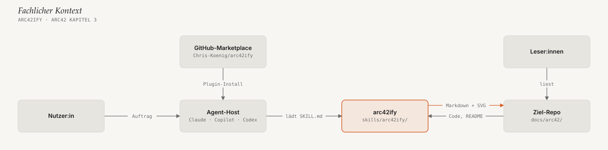

# arc42-Dokumentation — arc42ify

Architekturdoku für **neue Entwickler:innen im Team**: was `arc42ify` ist,
woraus es besteht, wie die Teile zusammenspielen und worauf man beim Ändern
achten muss. Sie folgt [arc42](https://arc42.de/) und wurde mit dem Skill
aus diesem Repo erzeugt — sie ist also auch ein zweites, echtes Beispiel
neben dem fiktiven [Bohnenwerk-Shop](../../docs-example/docs/arc42/00-index.md).

Wie man den Skill *benutzt*, steht nicht hier, sondern in
[docs/usage.md](../usage.md) und [docs/installation.md](../installation.md).

## Kapitel

| Kapitel | Status | Diagramme |
|---|---|---|
| [1. Einführung und Ziele](01-einfuehrung-und-ziele.md) | Entwurf — Priorisierung der Qualitätsziele bestätigen | — |
| [2. Randbedingungen](02-randbedingungen.md) | vollständig | — |
| [3. Kontextabgrenzung](03-kontextabgrenzung.md) | vollständig | Kontextdiagramm |
| [4. Lösungsstrategie](04-loesungsstrategie.md) | vollständig | — |
| [5. Bausteinsicht](05-bausteinsicht.md) | vollständig | Ebene 1, Whitebox Skill |
| [6. Laufzeitsicht](06-laufzeitsicht.md) | vollständig | Doku erzeugen, `boxes`-Diagramm rendern |
| [7. Verteilungssicht](07-verteilungssicht.md) | vollständig | Verteilung |
| [8. Querschnittliche Konzepte](08-querschnittliche-konzepte.md) | vollständig | Schichtenmodell |
| [9. Architekturentscheidungen](09-architekturentscheidungen.md) | vollständig (rekonstruiert) | — |
| [10. Qualitätsanforderungen](10-qualitaetsanforderungen.md) | Entwurf — 2 offene Punkte | — |
| [11. Risiken und technische Schulden](11-risiken-und-technische-schulden.md) | vollständig | — |
| [12. Glossar](12-glossar.md) | vollständig | — |

## Für den Einstieg

**Lesereihenfolge (ca. 30 Minuten):** [1](01-einfuehrung-und-ziele.md) →
[3](03-kontextabgrenzung.md) → [4](04-loesungsstrategie.md) →
[5](05-bausteinsicht.md) → [6.2](06-laufzeitsicht.md#62-ein-boxes-diagramm-rendern) →
[8](08-querschnittliche-konzepte.md) → [11](11-risiken-und-technische-schulden.md).
Kapitel 2 und 10 sind Nachschlagewerk: Dort steht, welcher Test welche
Regel absichert.

**Erste Stunde im Repo** — alles aus dem Repo-Root, nichts zu installieren:

```bash
python3 -m unittest discover -s tests -v
```

```bash
python3 skills/arc42ify/scripts/render_diagram.py skills/arc42ify/assets/templates/context-diagram.json /tmp/kontext.svg
```

```bash
python3 skills/arc42ify/scripts/self_check.py tests/fixtures/fail/boxes-label-too-long.json
```

Das erste Kommando muss grün sein, das zweite schreibt ein SVG zum Ansehen im
Browser, das dritte zeigt, wie ein `FAIL` aussieht. Danach lohnt ein Blick in
[`render_diagram.py`](../../skills/arc42ify/scripts/render_diagram.py),
Abschnitt `# ---- "boxes": layout`.

## Auf einen Blick



## Diagramme dieser Doku ändern

Specs liegen neben den SVGs unter `assets/diagrams/`. Aus dem Repo-Root:

```bash
for spec in docs/arc42/assets/diagrams/*.diagram.json; do
  svg="${spec%.diagram.json}.svg"
  python3 skills/arc42ify/scripts/render_diagram.py "$spec" "$svg"
  python3 skills/arc42ify/scripts/self_check.py "$spec" "$svg"
done
```

Nach einer Renderer-Änderung diese Schleife laufen lassen. Die Tests
rendern auch diese Diagramme bei jedem Lauf neu und schlagen fehl, sobald
ein eingechecktes SVG veraltet ist.
