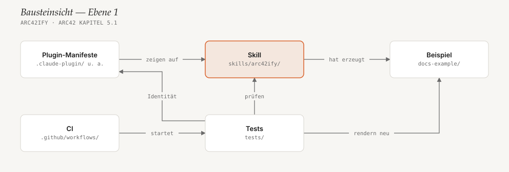
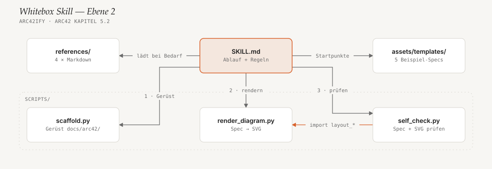

# 5. Bausteinsicht

<!-- status: vollständig -->

## 5.1 Whitebox Gesamtsystem (Ebene 1)

Das Repo enthält genau einen Baustein, der bei Nutzer:innen landet: den
Skill-Ordner `skills/arc42ify/`. Alles andere — Manifeste, Tests, Beispiel,
Handbuch — dient dazu, ihn zu verteilen, abzusichern oder zu erklären.

Pfeile bedeuten „nutzt“ bzw. „prüft“. Das Handbuch unter `docs/` fehlt im
Bild; es verlinkt nur auf die anderen Bausteine.

| Baustein | Verantwortung | Wo |
|---|---|---|
| **Skill** | Anleitung für den Agenten plus die drei Scripts. Der einzige Ordner, der installiert wird. Siehe [5.2](#52-whitebox-skill-ebene-2). | [`skills/arc42ify/`](../../skills/arc42ify/SKILL.md) |
| **Plugin-Manifeste** | Machen das Repo zu Plugin *und* Marketplace. Claude Code und Copilot CLI lesen `.claude-plugin/`, Codex liest `.codex-plugin/` und `.agents/plugins/`. Alle zeigen auf denselben Skill-Ordner. | [`.claude-plugin/`](../../.claude-plugin/plugin.json), [`.codex-plugin/`](../../.codex-plugin/plugin.json), [`.agents/plugins/`](../../.agents/plugins/marketplace.json) |
| **Tests** | Eine Datei, acht Testklassen, nur `unittest`. Rendern alle ausgelieferten Diagramme neu (Vorlagen, Beispiel, diese Doku), prüfen den Router, den Selbstcheck (mit kaputten und guten Fixtures), die CLI, das Gerüst, die Skill-Metadaten, die Manifeste und alle Markdown-Links. | [`tests/test_arc42ify.py`](../../tests/test_arc42ify.py), `tests/fixtures/{fail,pass}/` |
| **CI** | Führt die Tests bei jedem Push auf `master`/`main` und bei jedem Pull Request aus — auf Python 3.8, 3.13 und unter Windows. | [`.github/workflows/ci.yml`](../../.github/workflows/ci.yml) |
| **Beispiel „Bohnenwerk-Shop“** | Vollständig ausgefüllte, fiktive arc42-Doku mit 7 Diagrammen. Zeigt Nutzer:innen das Ergebnis und dient den Tests als Regressionsmaterial. | [`docs-example/`](../../docs-example/README.md) |
| **Handbuch** | Installation je Host, Nutzung, Vision und Roadmap — für Menschen. | [`docs/`](../usage.md), [README](../../README.md), [CONTRIBUTING](../../CONTRIBUTING.md) |

## 5.2 Whitebox Skill (Ebene 2)

Die Nummern an den Pfeilen geben die Reihenfolge im Ablauf von `SKILL.md`
wieder ([6.1](06-laufzeitsicht.md#61-doku-für-ein-repo-erzeugen)). Die
hervorgehobene Kante ist die wichtigste Kopplung im Code: Der Selbstcheck
hat keine eigene Geometrie, sondern importiert die des Renderers.

| Baustein | Verantwortung | Schnittstelle |
|---|---|---|
| **`SKILL.md`** | Frontmatter (`name`, `description` mit Trigger-Wörtern, `compatibility`) und der Ablauf in fünf Schritten: Quelle bestimmen → Gerüst → pro Kapitel Fakten, Text, Bild → Diagramme rendern und prüfen → Index und Zusammenfassung. | Wird vom Host gelesen; Regeln siehe [TR3/TR4](02-randbedingungen.md#21-technische-randbedingungen) |
| **`references/`** | Wissen, das der Agent nur bei Bedarf lädt: [`arc42-sections.md`](../../skills/arc42ify/references/arc42-sections.md) (Kapitel → Quelle im Code → Diagrammtyp), [`diagram-spec.md`](../../skills/arc42ify/references/diagram-spec.md) (JSON-Format), [`style-guide.md`](../../skills/arc42ify/references/style-guide.md) (Design-Tokens), [`multi-agent-usage.md`](../../skills/arc42ify/references/multi-agent-usage.md) (Installationspfade je Host). | Markdown |
| **`assets/templates/`** | Fünf Beispiel-Specs (Kontext, Bausteine, Verteilung, Schichten, Sequenz) mit gerenderten SVGs. Startpunkte zum Kopieren, keine Pflichtstruktur. | `*.json` + `*.svg` |
| **`scaffold.py`** | Legt `docs/arc42/00-index.md` bis `12-glossar.md` und `assets/diagrams/` an, auf Deutsch oder Englisch. Überschreibt nie eine vorhandene Datei. | `scaffold.py <repo> [--lang de\|en]` |
| **`render_diagram.py`** | JSON-Spec → SVG. Enthält Layout, Kanten-Router und Zeichenfunktionen für alle drei Diagrammarten. Siehe [5.3](#53-whitebox-render_diagrampy-ebene-3). | `render_diagram.py <spec> <svg>`; als Modul: `render_svg(spec)`, `layout_boxes(spec)`, `layout_sequence(spec)` |
| **`self_check.py`** | Prüft eine Spec (Referenzen, Anzahl Akzente, Mindestgröße) und die Geometrie, die der Renderer daraus macht (Kanten durch Boxen, Label-Kollisionen, zu breiter Text, Gruppen, die fremde Knoten einschließen). Optional auch das SVG selbst (`<title>`, keine Schatten, keine externen URLs). | `self_check.py <spec> [<svg>]`; Exit-Code 1 bei Befund; als Modul: `check(spec)`, `check_svg(text)` |

## 5.3 Whitebox `render_diagram.py` (Ebene 3)

Hier passiert fast jede Änderung. Die Datei ist in Abschnitte gegliedert,
die mit `# ---- …` beginnen:

| Abschnitt | Wichtige Namen | Aufgabe |
|---|---|---|
| Konstanten und Tokens | `GRID`, `STEP`, `NODE_W`/`NODE_H`, `CELL_W`/`CELL_H`, `*_COST`, `DEFAULT_THEME` | Alle Maße und Routing-Kosten an einer Stelle. `DEFAULT_THEME` spiegelt [`style-guide.md`](../../skills/arc42ify/references/style-guide.md). |
| Textmetrik | `mono_width`, `sans_width`, `title_width`, `edge_label_size` | Schätzt Textbreiten ohne Schriftdatei ([8.4](08-querschnittliche-konzepte.md#84-geschätzte-textbreiten)). |
| Geometrie-Helfer | `rects_overlap`, `segment_hits_rect`, `segments`, `simplify` | Von Router, Label-Platzierung **und** `self_check.py` genutzt. |
| `boxes`: Layout | `node_rect`, `group_geometry`, `Router`, `place_label`, `layout_boxes` | Knoten aufs Raster, Kanten routen, Labels platzieren. `layout_boxes` gibt die komplette Geometrie zurück. |
| `boxes`: Zeichnen | `node_svg`, `edge_label_svg`, `render_boxes` | Zeichnet in fester Reihenfolge: Gruppen → Kanten → Knoten → Labels, damit nie ein Label übermalt wird. |
| `layers` | `render_layers` | Gestapelte Schichten mit Stichworten. Kein eigenes Layout nötig. |
| `sequence` | `layout_sequence`, `render_sequence` | Lebenslinien, eine Zeile je Nachricht, Selbstaufrufe als Schleife. |
| Rahmen | `RENDERERS`, `marker_defs`, `render_svg`, `render` | Wählt den Renderer nach `kind`, setzt Titel, Rand und Pfeilspitzen, schreibt die Datei mit LF. |

**Router in Kürze.** Jede Box plus ein Gitterschritt Rand ist gesperrt,
dadurch halten Kanten mindestens 24px Abstand zu fremden Boxen. Jede Kante startet
und endet an einem eigenen Anschlusspunkt („Port“) auf einer Boxseite. Die
Suche ist Dijkstra über (Punkt, Richtung) auf einem 12px-Gitter; Kosten
entstehen für Länge, Knicke, Kreuzungen, gemeinsam genutzte Strecken und
Wege durch bereits platzierte Labels. Kanten zwischen direkten Nachbarn
werden zuerst geroutet, dann nach Abstand — so bekommen einfache Kanten die
geraden Wege. Ablauf siehe [6.2](06-laufzeitsicht.md#62-ein-boxes-diagramm-rendern).
