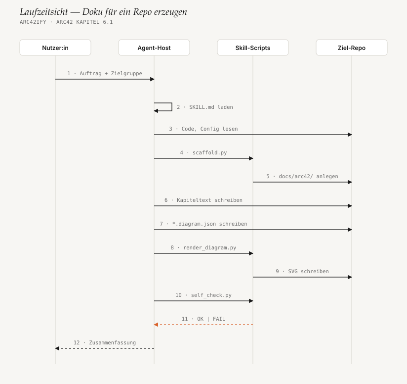

# 6. Laufzeitsicht

<!-- status: vollständig -->

## 6.1 Doku für ein Repo erzeugen

Der Hauptablauf, so wie `SKILL.md` ihn vorschreibt. Die Scripts sind in
einer Spalte zusammengefasst; welches gerade läuft, steht am Pfeil.

1. **Auftrag.** Die Nutzer:in bittet um Architekturdoku, am besten mit
   Zielgruppe und Sprache. Der Host vergleicht die Bitte mit der
   `description` aller installierten Skills und lädt `SKILL.md` (Schritt 2).
   Ruft sie `/arc42ify` ausdrücklich auf, entfällt das Raten.
2. **Quelle lesen (3).** Der Agent liest Ordnerstruktur, Entry-Points,
   Abhängigkeiten, Infrastruktur-Dateien und README des Ziel-Repos.
   Welche Datei für welches Kapitel zählt, steht in `arc42-sections.md`.
3. **Gerüst (4–5).** `scaffold.py` legt die 13 Markdown-Dateien und
   `assets/diagrams/` an; vorhandene Dateien bleiben unberührt.
4. **Pro Kapitel: Fakten → Text → Bild (6–9).** Erst wird der Kapiteltext
   geschrieben, dann — nur für Kapitel, in denen ein Bild mehr sagt als ein
   Satz — eine Spec, die `render_diagram.py` zu einem SVG macht.
5. **Prüfen (10–11).** `self_check.py` meldet `OK` oder `FAIL` mit einer
   Liste konkreter Befunde. Bei `FAIL` korrigiert der Agent die Spec
   (Label kürzen, Knoten umsetzen) und springt zurück zu Schritt 8.
6. **Abschluss (12).** Index mit Status je Kapitel, Zusammenfassung an die
   Nutzer:in. Committet wird nur auf ausdrückliche Bitte.

## 6.2 Ein `boxes`-Diagramm rendern

Was in `render_diagram.py` passiert, wenn ein Kontext-, Baustein- oder
Verteilungsdiagramm gerendert wird. Für neue Entwickler:innen der wichtigste
Ablauf, weil hier die meisten Änderungen landen.

- **Schritt 5:** `node_rect` setzt jeden Knoten auf `col × CELL_W`,
  `row × CELL_H`; Breite und Höhe werden auf ein Vielfaches von
  `PORT_PITCH` gerundet, damit Seitenmitten und Ports auf dem Gitter liegen.
  `group_geometry` legt die Gruppenrahmen um ihre Mitglieder.
- **Schritt 7 ist die Schleife:** einmal je Kante, direkte Nachbarn zuerst,
  dann nach Abstand. Jede geroutete Kante belegt ihre Ports und Strecken; die
  nächste Kante zahlt für Kreuzungen und gemeinsame Strecken.
- **Schritt 9:** `place_label` probiert das längste Kantenstück zuerst,
  jeweils in der Mitte, dann zu den Enden hin. Ein platziertes Label wird
  für die folgenden Kanten teuer (`NEAR_LABEL_COST`).
- **Schritt 12–13:** `render_svg` gibt jedem Renderer einen Ursprung bei
  (0, 0) und setzt Titel und `MARGIN` einheitlich; `render` schreibt mit LF.

Findet der Router für eine Kante keinen freien Port mehr, bricht er mit
`could not route edge A -> B: no free port left` ab.

## 6.3 Selbstcheck einer Spec

Bewusst ohne Diagramm — der Ablauf ist linear:

1. `check_spec` prüft die Struktur: bekannter `kind`, alle `id`-Referenzen
   auflösbar, `col`/`row` vorhanden, höchstens zwei `focal`, Mindestgröße
   (3 Knoten, 2 Schichten, 2 Lanes / 2 Nachrichten).
2. `can_lay_out` entscheidet, ob die Geometrie berechnet werden kann — bei
   unbekannten Referenzen würde der Renderer abstürzen, also wird hier
   abgebrochen und nur der Strukturfehler gemeldet.
3. Die passende Geometrieprüfung ruft **dieselbe** Layout-Funktion wie der
   Renderer (`rd.layout_boxes` bzw. `rd.layout_sequence`) und prüft deren
   Ergebnis: überlappende Knoten, Text breiter als seine Box, Kanten durch
   fremde Boxen oder übereinander, Labels auf Boxen, Labels, Kanten oder
   Pfeilspitzen, Gruppen mit fremden Knoten.
4. Mit SVG-Argument prüft `check_svg` zusätzlich `<title>`, Schatten und
   externe URLs.
5. Ausgabe `OK — <spec>` mit Exit-Code 0 oder `FAIL — n issue(s)` mit einer
   Zeile je Befund und Exit-Code 1.

## 6.4 Doku nach einer Code-Änderung aktualisieren

1. Der Agent erkennt an `docs/arc42/`, dass schon eine Doku existiert.
2. Er bestimmt, welche Kapitel die Änderung betrifft (neue Komponente →
   Kapitel 5, neue Infrastruktur → Kapitel 7 …).
3. Nur diese Kapitel und ihre Specs werden geändert, die SVGs neu gerendert
   und geprüft. Alles andere bleibt unangetastet, damit der Diff im Pull
   Request lesbar bleibt.

## 6.5 CI-Lauf in diesem Repo

1. Push auf `master`/`main` oder ein Pull Request startet
   [`ci.yml`](../../.github/workflows/ci.yml).
2. Drei Jobs parallel: Python 3.8 auf `ubuntu-22.04`, 3.13 auf
   `ubuntu-latest`, 3.12 auf `windows-latest`; `fail-fast: false`, damit
   ein Windows-Fehler die Linux-Ergebnisse nicht verdeckt.
3. Jeder Job führt `python -m unittest discover -s tests -v` aus
   (Timeout 10 Minuten). Ein veraltetes SVG lässt den Test mit dem genauen
   Befehl zum Neu-Rendern scheitern.
