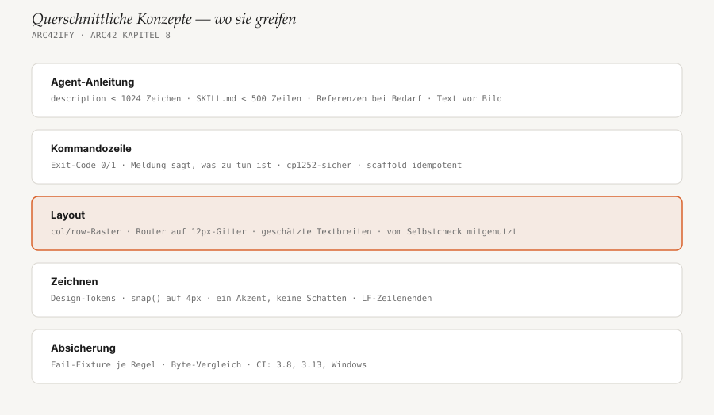

# 8. Querschnittliche Konzepte

<!-- status: vollständig -->

Das Bild zeigt, auf welcher Ebene welches Konzept greift. Hervorgehoben ist
die Layout-Ebene: Sie wird von Renderer **und** Selbstcheck genutzt, und
fast jede Änderung am Renderer berührt sie.



## 8.1 Design-System und Theme

Alle Farben und Schriften stehen als Tokens in `DEFAULT_THEME`
(`render_diagram.py`) und — mit Begründung — in
[`style-guide.md`](../../skills/arc42ify/references/style-guide.md). Beide
müssen übereinstimmen; es gibt keinen Test dafür.

- **Ein Akzent:** `accent` nur für `kind: "focal"`, höchstens zwei Mal pro
  Diagramm (vom Selbstcheck geprüft). Alles andere ist `ink` auf `paper`
  mit 1px-`hairline`-Rahmen.
- **Keine Schatten**, Eckradius ≤ 10px, drei Schriftrollen (Titel kursiv
  Serife, Label Sans halbfett, technische Angaben Mono).
- **Systemschriften** statt Webfonts, damit alles offline gleich rendert.
- **Überschreiben** pro Diagramm über `"theme": {"accent": "#0b6bcb"}` in der
  Spec; `merge_theme()` legt das über die Defaults.

Neue Zeichenfunktionen verwenden immer `theme[...]`, nie feste Farbwerte —
sonst bricht das Corporate-Design-Override.

## 8.2 Eine Geometrie für Renderer und Selbstcheck

Der Selbstcheck soll prüfen, was *wirklich* gezeichnet wird. Deshalb
berechnet er nichts selbst, sondern ruft die Layout-Funktionen des Renderers:

```python
# self_check.py
import render_diagram as rd

def check_boxes_geometry(spec):
    lay = rd.layout_boxes(spec)          # dieselben Zahlen wie beim Zeichnen
    boxes, edges, groups = lay["boxes"], lay["edges"], lay["groups"]
    ...
```

Die Regel für Beiträge: **Geometrie, die geprüft werden soll, gehört in eine
`layout_<kind>()`-Funktion**, die `render_<kind>()` und der Check gemeinsam
nutzen. Heute gibt es `layout_boxes` und `layout_sequence`; `layers` braucht
keine, weil es nur feste Zeilen hat. Auch die Geometrie-Helfer
(`rects_overlap`, `segment_hits_rect`, `arrow_tip_rect`) liegen deshalb im
Renderer.

## 8.3 Determinismus und Reproduzierbarkeit

Dieselbe Spec muss Byte für Byte dasselbe SVG ergeben, auf jedem System:

- Koordinaten laufen durch `snap()` (4px) bzw. liegen auf dem 12px-Gitter
  des Routers; Knotengrößen werden auf `PORT_PITCH` gerundet.
- Reihenfolgen sind stabil: Kanten werden nach (direkt?, Abstand, Index)
  sortiert, die Prioritätswarteschlange im Router hat einen laufenden
  Tiebreaker, Python-Sortierung ist stabil.
- Keine Zeitstempel, keine Zufallswerte, keine Pfade im SVG.
- `render()` schreibt mit `newline="\n"`; `.gitattributes` hält `*.svg` auf
  LF, auch wenn Git unter Windows Zeilenenden umwandelt.

Der Test `test_committed_svgs_match_a_fresh_render` rendert alle
Vorlagen, die Beispiel-Diagramme und die Diagramme dieser Doku neu und
vergleicht. Ändert eine
Renderer-Anpassung auch nur ein Pixel, müssen die betroffenen SVGs neu
gerendert und mit eingecheckt werden — die Fehlermeldung nennt den Befehl.

## 8.4 Geschätzte Textbreiten

Ohne Schriftdateien kann das Script Text nicht messen. Es schätzt:

| Funktion | Annahme | Genutzt für |
|---|---|---|
| `mono_width(s, size)` | 0,6 em je Zeichen (+ Laufweite) | Sublabels, Kanten-Labels, Gruppen-Labels |
| `sans_width(s, size)` | 0,6 em je Zeichen | Knoten- und Lane-Namen |
| `title_width(s)` | 0,5 × 19px je Zeichen | Breite des Titelblocks |

Daraus ergeben sich die Faustregeln aus
[`diagram-spec.md`](../../skills/arc42ify/references/diagram-spec.md):
etwa 20 Zeichen für ein Kanten-Label zwischen zwei Nachbarn, etwa 28 für
eine Nachricht im Sequenzdiagramm. Für Mono-Text ist die Schätzung genau,
für Proportionalschrift eine Näherung (siehe
[R1](11-risiken-und-technische-schulden.md#111-risiken)).

## 8.5 Kommandozeile und Fehlerbehandlung

- `render_diagram.py` und `self_check.py` drucken ohne Argumente ihren
  Docstring (`Usage: …`) und enden mit Exit-Code 1; `scaffold.py` nutzt
  `argparse` und endet dann mit Exit-Code 2.
- `self_check.py`: `OK — <spec>` mit Exit-Code 0 oder `FAIL — n issue(s)`
  mit einer Zeile je Befund und Exit-Code 1. Jede Meldung sagt, was zu tun
  ist („shorten it“, „give them different col/row“), weil sie ein Agent
  liest und umsetzt.
- `render_diagram.py` bricht mit `SystemExit(<Meldung>)` ab bei unbekanntem
  `kind` oder wenn der Router keinen freien Port findet. Eine ungültige Spec
  (fehlende `id`) führt dagegen zu einem Python-Traceback — deshalb gehört
  `self_check.py` immer mit in den Ablauf.
- Alle Scripts rufen `sys.stdout.reconfigure(errors="replace")` auf. Labels
  sind Nutzertext; eine Windows-Konsole mit cp1252 darf deshalb nicht
  abstürzen (Test `test_failures_exit_1_even_on_a_console_that_cannot_print_the_label`).
- `scaffold.py` ist idempotent: vorhandene Dateien werden mit
  `skip (exists)` übersprungen, nie überschrieben.

## 8.6 Progressive Disclosure in der Agent-Anleitung

Ein Agent hat begrenzten Kontext. Deshalb ist die Anleitung gestaffelt:

1. **`description`** (≤ 1024 Zeichen) — immer sichtbar, entscheidet über das
   Laden. Enthält deutsche und englische Trigger-Wörter.
2. **`SKILL.md`** (< 500 Zeilen) — wird geladen, wenn der Skill passt:
   Ablauf, Regeln, wann *kein* Diagramm.
3. **`references/*.md`** — nur bei Bedarf, z. B. `diagram-spec.md` erst,
   bevor ein Diagramm gebaut wird.

Wer Text in `SKILL.md` ergänzt, prüft zuerst, ob er nicht in eine Referenz
gehört.

## 8.7 Testkonzept

- **Jede Prüfregel hat eine kaputte Fixture** unter `tests/fixtures/fail/`
  und eine erwartete Meldung in `CheckerCatchesDefects.EXPECTED`. Ein Test
  stellt sicher, dass es keine Fixture ohne Erwartung gibt.
- **Gute Fixtures** unter `tests/fixtures/pass/` (z. B. dichtes Routing)
  beweisen, dass dieselben Regeln bei korrekten Diagrammen still bleiben.
- **Alle ausgelieferten Diagramme** (Vorlagen, `docs-example/` und
  `docs/arc42/`) laufen durch Selbstcheck und Byte-Vergleich.
- **Das Gerüst** wird in beiden Sprachen erzeugt und geprüft: 13 Dateien,
  Statusspalte im Index, Stubs in der gewählten Sprache, nichts wird
  überschrieben.
- **Router-Eigenschaften** werden an allen guten Specs geprüft:
  rechtwinklig, Start und Ende auf der eigenen Box, Abstand zu fremden
  Boxen, eigener Port je Kantenende, alles im 4px-Raster.
- **Metadaten und Repo-Hygiene:** Frontmatter, Trigger-Wörter,
  Manifest-Identität, Python-3.8-Syntax, relative Markdown-Links.

## 8.8 Sprache und Benennung

- Kapitel-, Anleitungs- und Handbuchtext auf Deutsch; Code-Kommentare,
  Bezeichner und Script-Meldungen auf Englisch.
- Gendern mit Doppelpunkt („Nutzer:innen“), wie im restlichen Repo.
- Specs heißen `<kapitel>-<name>.diagram.json`, das SVG daneben
  `<kapitel>-<name>.svg`.
