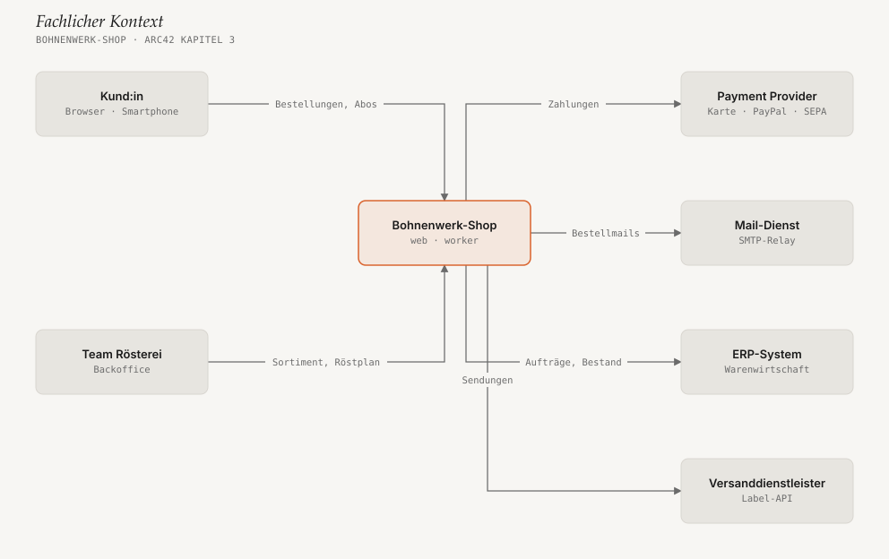

# Nutzung

Du sagst dem Agenten, was dokumentiert werden soll — der Skill sorgt dafür,
dass daraus arc42 wird: 12 Kapitel unter `docs/arc42/`, Diagramme als SVG,
nichts erfunden. Wie das Ergebnis aussieht, zeigt das
[Beispiel Bohnenwerk-Shop](../docs-example/docs/arc42/00-index.md).

- [Aufrufen](#aufrufen)
- [Typische Aufträge](#typische-aufträge)
- [Was der Agent tut](#was-der-agent-tut)
- [Das Ergebnis](#das-ergebnis)
- [Diagramme ändern](#diagramme-ändern)
- [Diagramme prüfen](#diagramme-prüfen)
- [Eigene Farben und Schriften](#eigene-farben-und-schriften)
- [In der CI prüfen](#in-der-ci-prüfen)
- [Tipps](#tipps)

## Aufrufen

Der Skill springt **automatisch** an, wenn deine Bitte nach
Architekturdoku klingt („dokumentiere die Architektur“, „arc42 für dieses
Repo“). Du kannst ihn auch ausdrücklich aufrufen:

| Host | Ausdrücklich aufrufen |
|---|---|
| Claude Code | `/arc42-docs` (als Plugin installiert: `/arc42-docs:arc42-docs`) |
| GitHub Copilot — CLI und VS Code Agent-Modus | `/arc42-docs` |
| GitHub Copilot — Cloud-Agent | Issue beschreiben und Copilot zuweisen, z. B. „Erstelle eine arc42-Doku für dieses Repo“ |
| OpenAI Codex — CLI und IDE | `$arc42-docs` |

Starte den Agenten im **Root des Repos**, das dokumentiert werden soll.

## Typische Aufträge

### Ein bestehendes Repo dokumentieren

```text
/arc42-docs Erstelle eine arc42-Doku für dieses Repo. Zielgruppe sind
neue Entwickler:innen im Team. Schreib auf Deutsch.
```

Der Agent liest Code, Abhängigkeiten, Infrastruktur-Dateien und README und
füllt daraus die Kapitel. Was sich nicht aus dem Repo ergibt — etwa
Qualitätsziele oder Stakeholder —, fragt er nach oder markiert es als offen.

### Eine Idee dokumentieren, bevor es Code gibt

```text
/arc42-docs Wir bauen einen Terminbuchungs-Service für Arztpraxen.
Praxen pflegen Zeitfenster, Patient:innen buchen per Web. Anbindung an den
Praxis-Kalender über CalDAV, SMS-Erinnerungen über einen externen Dienst.
Python/FastAPI, Hosting in der EU. Leg die Doku unter docs/arc42/ an.
```

Kapitel ohne ausreichende Information bleiben als `<!-- TODO -->` markiert
— der Skill erfindet keine plausibel klingenden Details.

### Vorhandene Notizen überführen

```text
/arc42-docs Überführe docs/wiki-export/ und das Miro-Board (Screenshot
anbei) in eine arc42-Doku. Übernimm die Inhalte der vorhandenen Diagramme,
nicht ihre Optik.
```

### Nach einer Code-Änderung aktualisieren

```text
/arc42-docs Wir haben einen Redis-Cache und einen neuen Worker-Prozess
eingeführt (siehe letzten Merge). Aktualisiere nur die betroffenen Kapitel.
```

Der Agent ändert nur, was sich geändert hat — hier typischerweise Kapitel 5
(Bausteine), 7 (Verteilung) und die zugehörigen Diagramme. Der Rest bleibt
unangetastet, damit der Diff im Pull Request lesbar bleibt.

### Nur ein Kapitel oder ein Diagramm

```text
/arc42-docs Schreib Kapitel 6 (Laufzeitsicht) für den Login-Flow mit
Token-Refresh, mit Sequenzdiagramm.
```

## Was der Agent tut

1. **Quelle lesen** — Code, Konfiguration, Infrastruktur, Notizen oder deine
   Beschreibung.
2. **Gerüst anlegen** — `docs/arc42/00-index.md` bis `12-glossar.md` und
   `assets/diagrams/`. Vorhandene Dateien werden nie überschrieben.
3. **Pro Kapitel: erst Fakten, dann Text, dann Bild.** Ein Diagramm gibt es
   nur, wo es mehr sagt als ein Satz — typischerweise in Kapitel 3, 5, 6, 7
   und 8.
4. **Diagramme bauen** — der Agent schreibt eine kleine JSON-Spec (welche
   Knoten, welche Kanten), das Script rendert daraus das SVG und prüft es.
5. **Index aktualisieren** — Status je Kapitel: vollständig, Entwurf oder
   offen.
6. **Zusammenfassen** — was neu ist, was noch fehlt. Committet wird nur, wenn
   du darum bittest.

## Das Ergebnis

```text
docs/arc42/
├── 00-index.md                     Kapitelübersicht mit Status
├── 01-einfuehrung-und-ziele.md
├── …
├── 12-glossar.md
└── assets/diagrams/
    ├── 03-kontext.diagram.json     Quelle — hier wird geändert
    ├── 03-kontext.svg              erzeugt — nie von Hand bearbeiten
    ├── 06-checkout.diagram.json
    └── 06-checkout.svg
```

Alles sind normale Dateien: GitHub zeigt Markdown und SVGs direkt an, es gibt
keinen Build-Schritt, und jedes SVG öffnet sich offline im Browser.



## Diagramme ändern

Jedes SVG hat eine `.diagram.json` daneben. Änderungen gehen **immer über die
Spec**:

```json
{
  "kind": "boxes",
  "title": "Fachlicher Kontext",
  "nodes": [
    {"id": "kunde", "label": "Kund:in", "kind": "external", "col": 0, "row": 0},
    {"id": "shop", "label": "Bohnenwerk-Shop", "kind": "focal", "col": 1, "row": 0},
    {"id": "psp", "label": "Payment Provider", "kind": "external", "col": 2, "row": 0}
  ],
  "edges": [
    {"from": "kunde", "to": "shop", "label": "bestellt"},
    {"from": "shop", "to": "psp", "label": "Zahlungen"}
  ]
}
```

Am einfachsten bittest du den Agenten: „Füge im Kontextdiagramm den
Versanddienstleister hinzu.“ Von Hand geht es so:

```bash
python3 .claude/skills/arc42-docs/scripts/render_diagram.py docs/arc42/assets/diagrams/03-kontext.diagram.json docs/arc42/assets/diagrams/03-kontext.svg
```

Den Pfad zu `scripts/` an deinen Installationsort anpassen (z. B.
`.agents/skills/…` oder `~/.claude/skills/…`).

| Diagrammtyp (`kind`) | Wofür | arc42-Kapitel |
|---|---|---|
| `boxes` | Kontext, Bausteine, Verteilung — Knoten auf einem Raster, Kanten dazwischen, optionale Gruppen | 3, 5, 7 |
| `sequence` | Abläufe zwischen Beteiligten | 6 |
| `layers` | Schichten mit Stichworten | 8 (ggf. 4) |

Das vollständige Format steht in
[`references/diagram-spec.md`](../skills/arc42-docs/references/diagram-spec.md).

## Diagramme prüfen

```bash
python3 .claude/skills/arc42-docs/scripts/self_check.py docs/arc42/assets/diagrams/03-kontext.diagram.json docs/arc42/assets/diagrams/03-kontext.svg
```

`OK` heißt: Spec gültig, keine Kante läuft durch eine Box, Beschriftungen
passen, höchstens zwei Akzente, keine externen Verweise im SVG. Bei `FAIL` steht in jeder Zeile, was zu tun ist — meist einen Knoten auf
ein anderes Feld setzen oder ein Label kürzen. Der Agent erledigt das
selbst, bevor er fertig meldet.

## Eigene Farben und Schriften

Die Standardfarben sind auf Kontrast geprüft. Für ein Corporate Design gibt
es zwei Wege:

- **Für ein einzelnes Diagramm:** ein `"theme"`-Feld in der Spec, z. B.
  `"theme": {"accent": "#0b6bcb"}`.
- **Für alle Diagramme:** die Tokens in
  [`references/style-guide.md`](../skills/arc42-docs/references/style-guide.md)
  und `DEFAULT_THEME` in `render_diagram.py` anpassen — am besten in der
  Projektkopie des Skills.

## In der CI prüfen

Ein GitHub-Actions-Job, der bei jedem Pull Request alle Specs prüft und
sicherstellt, dass die eingecheckten SVGs zur Spec passen:

```yaml
# .github/workflows/arc42.yml
name: arc42-Diagramme
on: [pull_request]
jobs:
  check:
    runs-on: ubuntu-latest
    steps:
      - uses: actions/checkout@v4
      - uses: actions/setup-python@v5
        with: { python-version: "3.12" }
      - name: Specs prüfen und SVGs vergleichen
        run: |
          S=.claude/skills/arc42-docs/scripts
          for spec in docs/arc42/assets/diagrams/*.diagram.json; do
            svg="${spec%.diagram.json}.svg"
            python3 "$S/render_diagram.py" "$spec" /tmp/check.svg
            python3 "$S/self_check.py" "$spec" /tmp/check.svg
            cmp -s /tmp/check.svg "$svg" || { echo "veraltet: $svg — neu rendern"; exit 1; }
          done
```

## Tipps

- **Sag, für wen die Doku ist.** „Für neue Entwickler:innen“ ergibt andere
  Schwerpunkte als „für den Architektur-Review mit dem Betrieb“.
- **Nenn, was der Code nicht verrät:** Qualitätsziele, Stakeholder,
  Randbedingungen aus Verträgen oder Budgets. Sonst bleiben Kapitel 1, 2 und
  10 offen — das ist gewollt, aber vermeidbar.
- **Reviewe wie Code.** Die Doku landet als Diff im Arbeitsverzeichnis;
  prüfe sie im Pull Request wie jede andere Änderung.
- **Aktualisiere mit, nicht nachträglich.** Nach größeren Merges den Agenten
  bitten, die betroffenen Kapitel nachzuziehen — der Skill ändert nur, was
  sich geändert hat.
